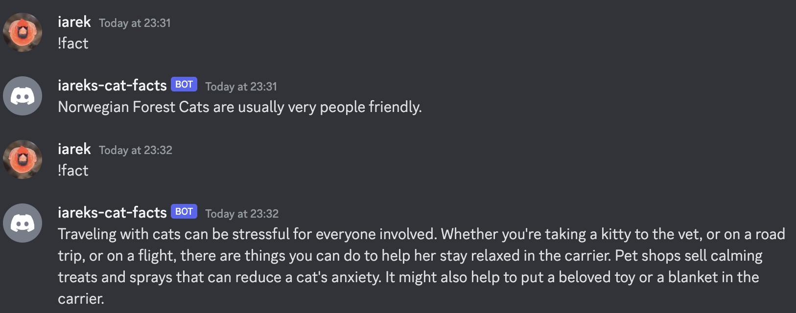

# CatFacts

**TODO: Add description**

## Discord bot

The bot will respond to any message with text `!fact`, and will post a random cat fact:



## Current state

The API can be called like that:

```elixir
iex(5)> CatFacts.ApiClient.get_random_fact()

23:15:27.080 [info] Received response with status code=200
{:ok,
 %{
   "__v" => 0,
   "_id" => "63d7cad26e605bbb069f1445",
   "createdAt" => "2023-01-30T13:49:06.481Z",
   "deleted" => false,
   "status" => %{"sentCount" => 0, "verified" => nil},
   "text" => "Cats purr because their vocal cords in their throats vibrate. So the muscles of the larynx open and close the passage of air about 25 times per second.",
   "type" => "cat",
   "updatedAt" => "2023-01-30T13:49:06.481Z",
   "user" => "63cd5150eec42e60ec32de30"
 }}
```

## Installation

If [available in Hex](https://hex.pm/docs/publish), the package can be installed
by adding `cat_facts` to your list of dependencies in `mix.exs`:

```elixir
def deps do
  [
    {:cat_facts, "~> 0.1.0"}
  ]
end
```

Documentation can be generated with [ExDoc](https://github.com/elixir-lang/ex_doc)
and published on [HexDocs](https://hexdocs.pm). Once published, the docs can
be found at <https://hexdocs.pm/cat_facts>.

